# Social App

SocialApp is a social networking application built with Flutter on the client side and Node.js, Express.js, and MongoDB on the server side. TypeScript is used throughout the project to enhance code quality and maintainability. Real-time communication is facilitated by Socket.IO.

## Technologies Used

| **Client Side**                                 | **Server Side**                                 |
|--------------------------------------------------|-------------------------------------------------|
| [Flutter](https://docs.flutter.dev/)             | [Node.js](https://nodejs.org/)                  |
| [Bloc](https://bloclibrary.dev/#/)         | [Express.js](https://expressjs.com/)            |
| [Provider](https://pub.dev/packages/provider)                   | [MongoDB](https://www.mongodb.com/)             |
|  [Socket.IO](https://socket.io/)    | [TypeScript](https://www.typescriptlang.org/)  |
|                  | [Socket.IO](https://socket.io/)                 |

## Features
* Login with username | email
   * login mutiple account with a device    
* Custom photo feed
* Post photo posts | video reel from camera or gallery
     * Post one or multiple image, and can edit its    
    * Like posts
    * Comment on posts
        * View all comments on a post
     * Deleting Posts
     * Saved post to favorite list
     * Lazy loading post with pagination in BE
     * Swipe image in Post
     * Reel 
* Explore Post same Instagram
   * Search for users with username
* Realtime Messaging
    * Can sending image, text and link post | reel
    * Reply story
* Profile Pages
    * change profile info
    * Follow / Unfollow Users
    * show user's post and reel that user post
    * show list user's follower and user's following
* Notifications Feed showing recent likes / comments of your posts + new followers
* Dark Mode Support
* Stories/Status
* Use Bloc to manage state

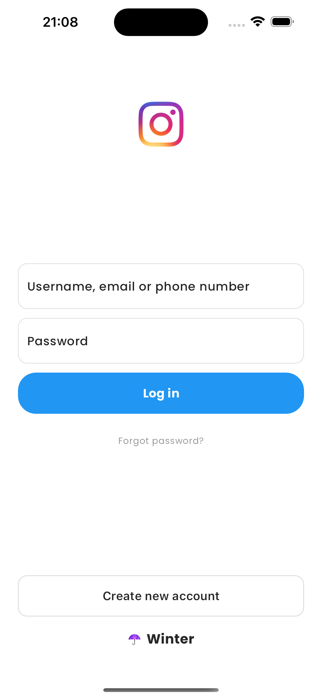 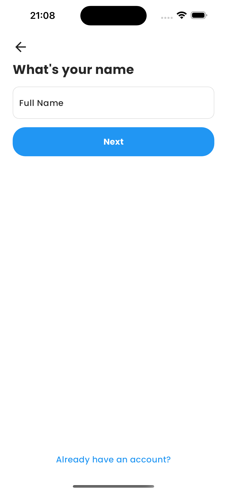
 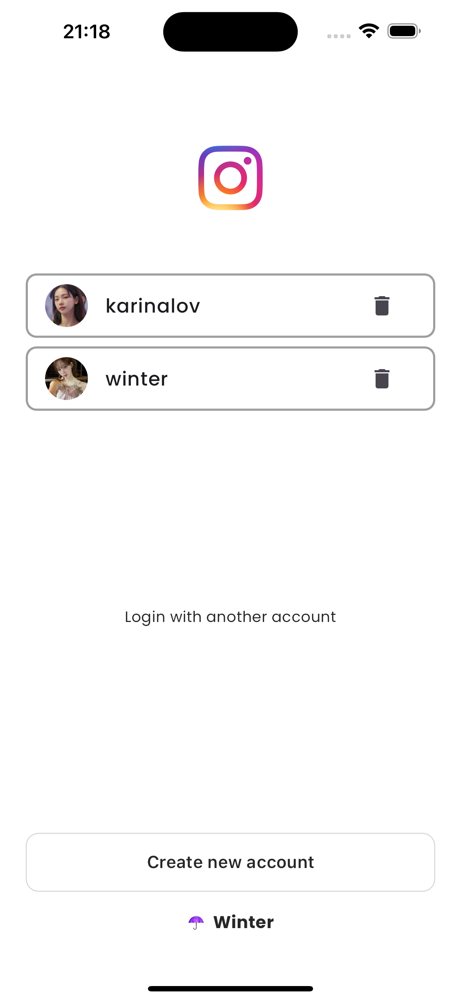
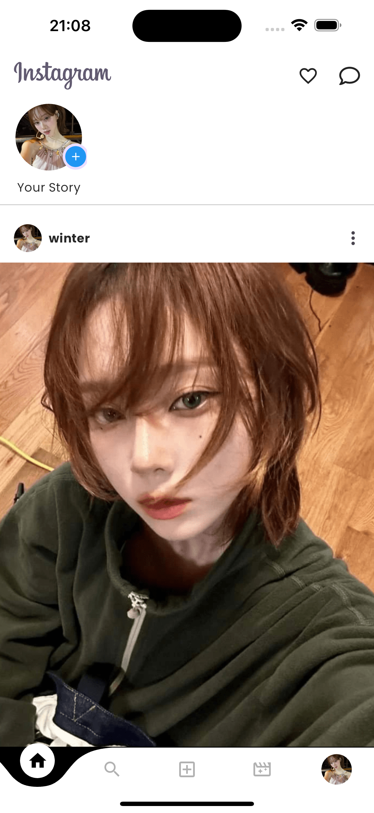 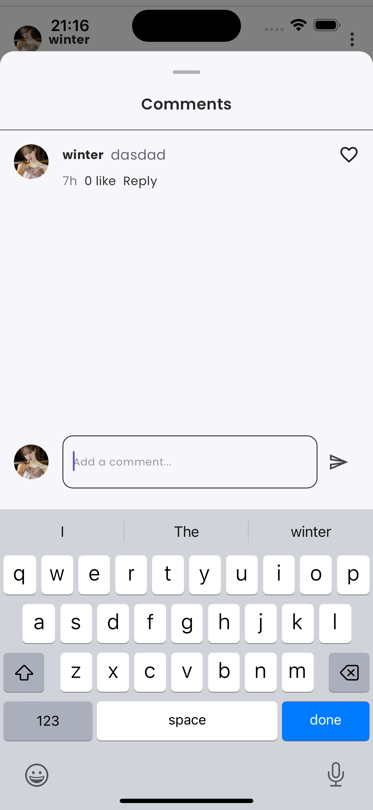
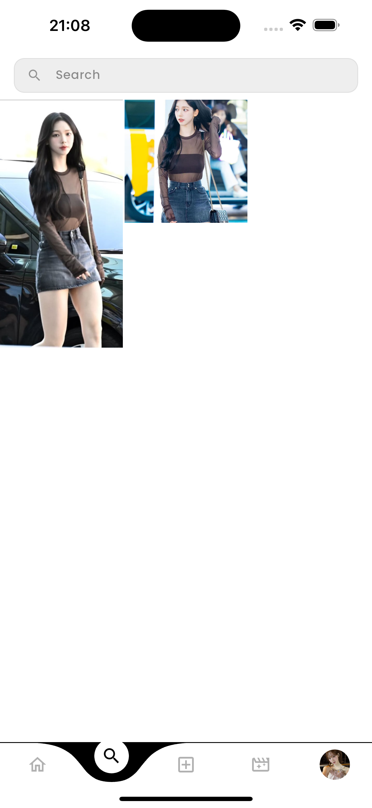 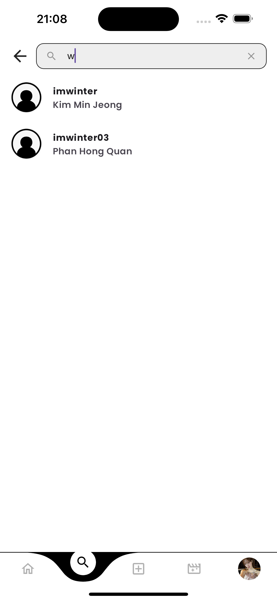
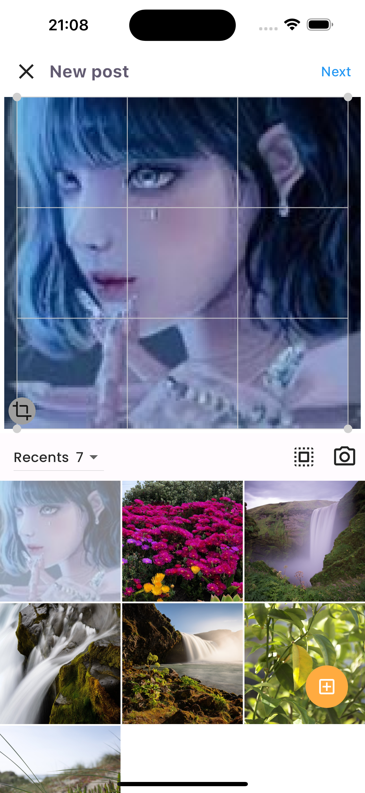 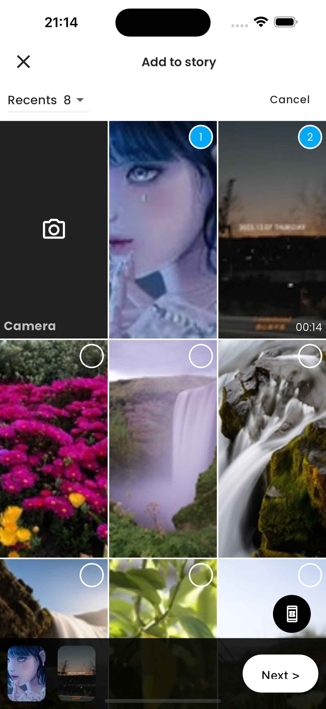
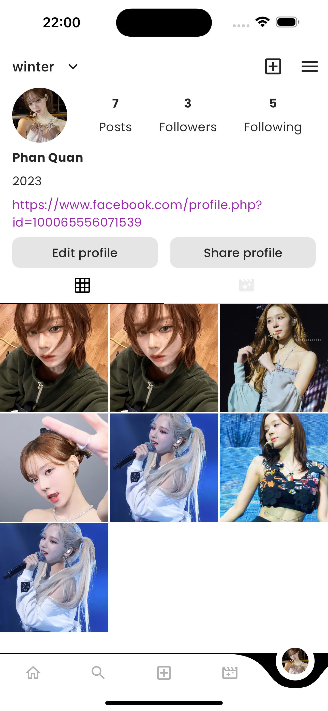 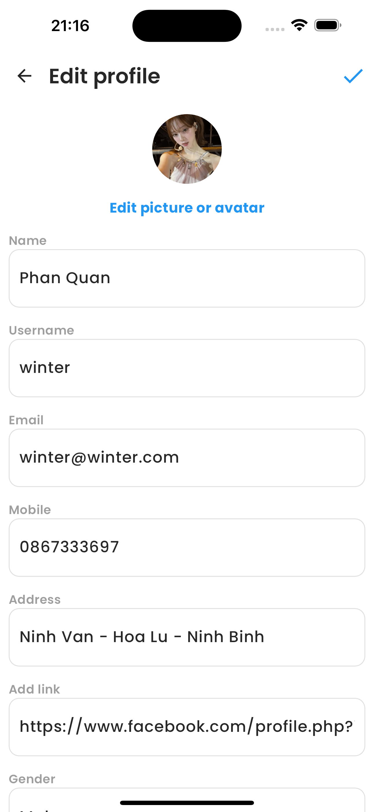
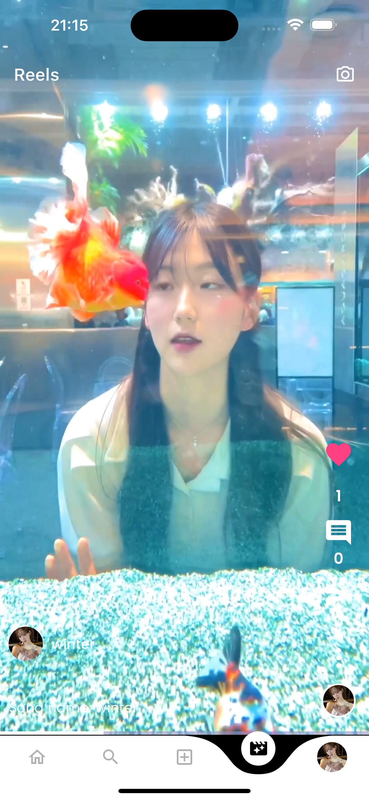 
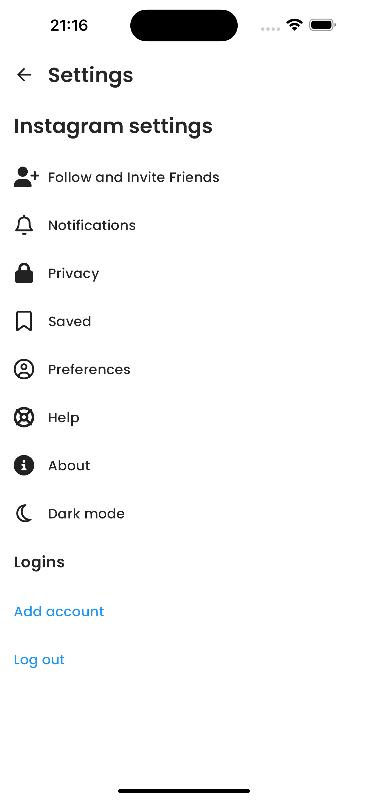 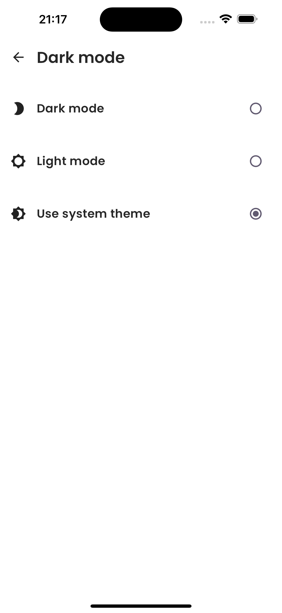

